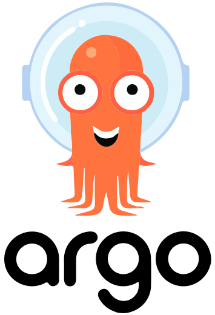

### Hi there 👋
- :bowtie: I am John Tambi, a passionate self-taught Cloud Engineer, with a great command in Linux systems and infrastructure provisioning. I enjoy testing existing technologies and always willing to learn and master new technologies.
- :rocket: I am currently working with the Azure Cloud deploying infrastructure, also building the CI/CD process using tools like Azure DevOps, ArgoCD and Helm.

 
 
- 💼 any freelance work? You can reach me by: [email: jon.tambi@gmail.com] :alien:
 
- 💬 ask me about anything, I am happy to help
 
 
**Tools and Technologies:**

<code></code>
<code></code>
<code></code>
<code></code>
<code></code>
<code></code>
<code></code>
<code></code>
<code></code>
<code></code>
<code></code>
<!--

**jontambi/jontambi** is a ✨ _special_ ✨ repository because its `README.md` (this file) appears on your GitHub profile.

Here are some ideas to get you started:

- 🔭 I’m currently working on ...
- 🌱 I’m currently learning ...
- 👯 I’m looking to collaborate on ...
- 🤔 I’m looking for help with ...
- 💬 Ask me about ...
- 📫 How to reach me: ...
- 😄 Pronouns: ...
- ⚡ Fun fact: ...
-->
